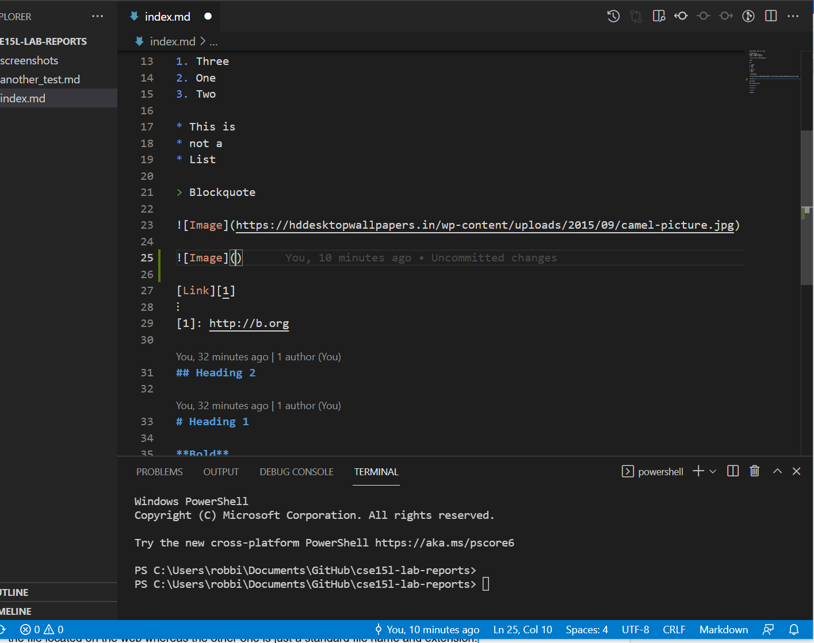

# Week 2 Lab Report

## Topic of discussion: Remote Access

Good Afternoon Audience. In this tutorial, you will see how to log into your course-specific account in a **step-by-step** process! (I know, very exciting stuff)

```
!Disclaimer! 
This tutorial is for Windows 10 operating sytem
based computers.
```

## Instal VS Code

Installing **VS Code** on your computer is as easy as 1-2-3. 

1. Go to [Visual Studio Code website](https://code.visualstudio.com/) & follow all the directions listed to download and install on your computer. 

**Note**: Make sure to install the version *specific* to your computer. In this case
you will download the Windows installer.

```
If you have any errors, reach out and ask! 
We would love to help!
```



