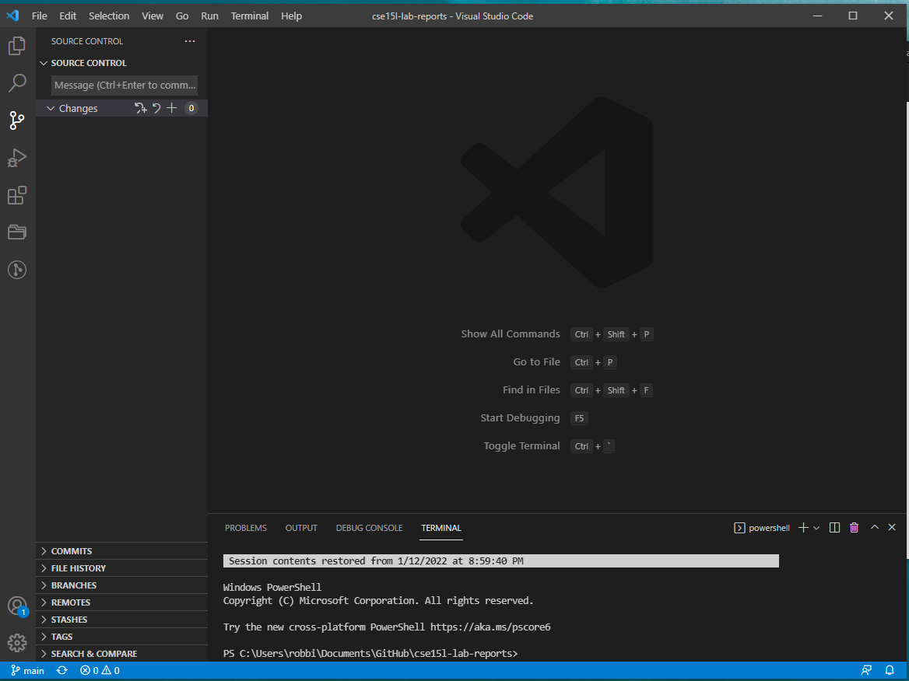
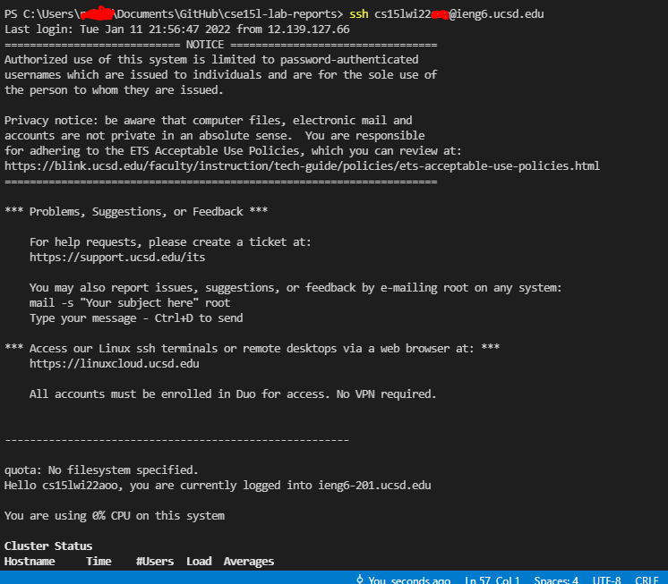
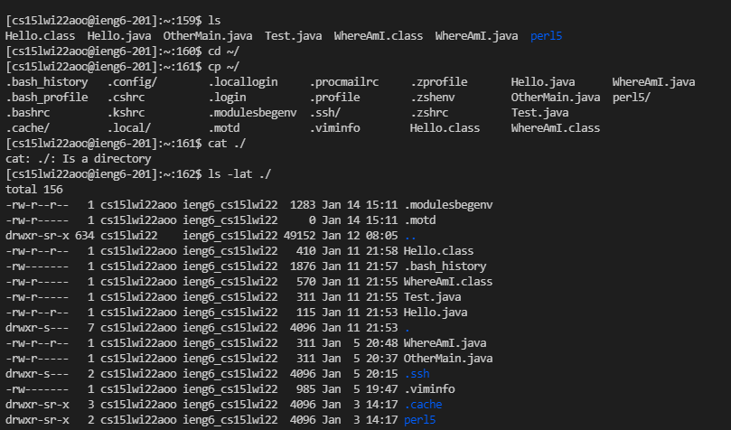
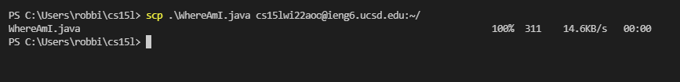
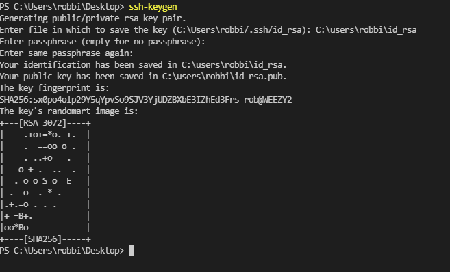
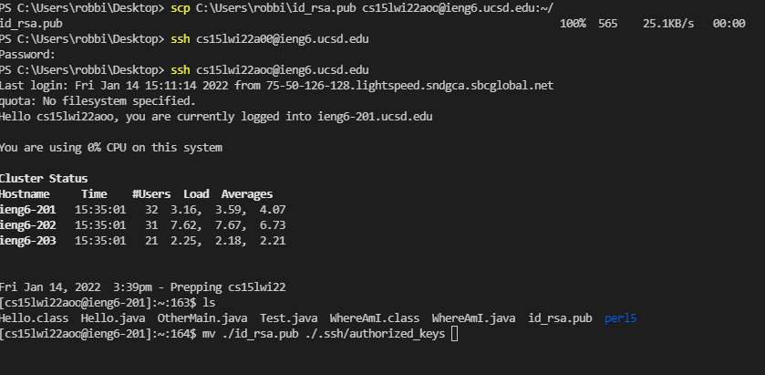
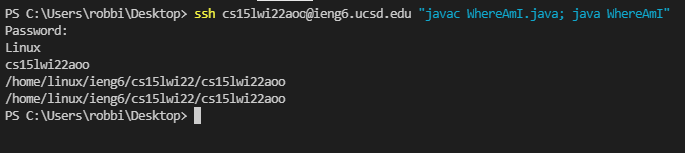
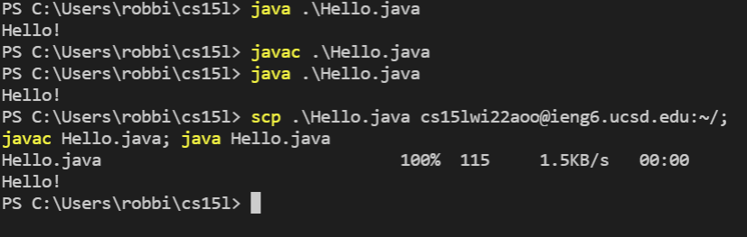

# Week 2 Lab Report

## Topic of discussion: Remote Access

Good Afternoon Audience. In this tutorial, you will see how to log into your course-specific account in a **step-by-step** process! (I know, very exciting stuff)

```
Disclaimer 
This tutorial is for Windows 10 operating sytem
based computers.
```

## Install VS Code

Installing **VS Code** on your computer is as easy as 1-2-3. 

Go to [Visual Studio Code website](https://code.visualstudio.com/) & follow all the directions listed to download and install on your computer. 

**Note**: Make sure to install the version *specific* to your computer. In this case
you will download the Windows installer.

```
If you have any errors, reach out and ask! 
We would love to help!
```

After the install completes, VS Code should look like this on your desktop.




## Connecting Remotely

As I touched on earlier, you'll have a CSE course specific account to login to once you have the necessary software needed to connect remotely using VS Code on your computer.
For this step, you'll have more installations of software to complete.

You'll need to install [OpenSSH](https://docs.microsoft.com/en-us/windows-server/administration/openssh/openssh_install_firstuse)

The link will show how to install the necessary software packages for Windows onto your computer. Stop following the steps before the doc begins explaining the SSH Server process. That will not apply for this lab.

Once this is completed, you'll want to look up your course specific account I keep mentioning [here](https://sdacs.ucsd.edu/~icc/index.php)


Now, we will be connecting to the UCSD servers from your computer using VS Code. 

We will be connecting using the terminal in VSCode, however there is the option to use the remote option as seen in a how-to here: [VS Code Site](https://code.visualstudio.com/docs/remote/ssh#_connect-to-a-remote-host). 

Now you will need to type your course specific account (in place of the 'qq' I have in my example.)

```
cs15lwi22qq@ieng6.ucsd.edu
```

Type the *ssh* command from your terminal to begin the connection:
```
ssh cs15lwi22qq@ieng6.ucsd.edu
```

The terminal will look like this after connecting:



There is a small change here:

During connection for the first time, you will be prompted by a yes/no question like this:

```
The authenticity of host 'ieng6.ucsd.edu (128.54.70.227)' can't be established.
RSA key fingerprint is SHA256:ksruYwhnYH+sySHnHAtLUHngrPEyZTDl/1x99wUQcec.
Are you sure you want to continue connecting (yes/no/[fingerprint])? 
```

Type yes to agree, then you will be prompted for your password. Enter your password and you should be connected like seen in the screenshot above!

## Trying out some Commands once connected

A great way to get to know the system your on is to check some frequently used commands:


* ls
* cd
* cd
* cat ./
* pwd
* cp ~/test.txt ~/testdir/
* vim ~/test.txt

These are great commands to use for various purposes, and trying them out will give you an idea on what they do once executed!

Check out the screenshot to see it in action:



## Move a file with SCP command

Next we will copy some files over using scp command.
Specifically, we will be copying a file from your computer client to the remote server using scp.

First, create a file locally on your computer and name it WhereAmI.java (source is from CSE15L jpolitz).

```
class WhereAmI {
  public static void main(String[] args) {
    System.out.println(System.getProperty("os.name"));
    System.out.println(System.getProperty("user.name"));
    System.out.println(System.getProperty("user.home"));
    System.out.println(System.getProperty("user.dir"));
  }
}
```

Then run the file using javac, then java. 

Now you should see the statistics of the computer you're working at home on. Now we will copy it over.

Type the following while ensuring to **Stay** in the same directory as the .java file you just made.

```
scp ./WhereAmI.java cs15lwi22qq@ieng6.ucsd.edu:~/
```

Type in your password afterwards, and you should see it copy over like the screenshot below:



## ssh key Setup

Getting tired of typing your password in over and over whether its for ssh or scp?
Well don't I have the best solution for you! *Enter* **ssh-keygen**!!!

This will allow you to create a public and private key so a relationship can be made between your client and the server, effectively allowing you to sign in remotely or copy files over remotely without typing a password anymore!

First step, type the following below **on your computer, not the server!!**:

```
ssh-keygen
```

See screenshot below to see it in action:



Remember to just press enter for the defaults when generating this.

Next you need to copy the **pubic** key to your profile directory in the specific filepath on the server using scp.

```
scp C:\users\rob\.ssh\id_rsa.pub cs15lwi22aoo@ieng6.ucsd.edu:~/.ssh/authorize_keys
```

See pic below:



## OPTIMIZATION? LETS

So much time consumed typing commands one by one, or taking time to connect to a server (even with our lovely new ssh-keygen in action)

Luckily, we can optimize a bit. For instance, typing multiple commands in one entry and executing all in order by themselves.. Neato!

```
ssh cs15lwi22qq@ieng6.ucsd.edu "javac WhereAmI.java; java WhereAmI"
```

This lets you ssh, compile your .java, and run your code all in one fail sweep. Check the screenshot below to see in action:



## Keystroke Optimization

A critical piece of coding involves efficiency. We want to try our best to shave down any time we can not associated with writing the code and debugging. So a great foundation to begin this way of thinking and executing is to bring down your total keystrokes. 

This can include executing multiple commands at the same time in the same line, and keeping the typing/mouse clicks to a minimum.

For example, say you've made a local edit to a .java file and want to copy over to the remote server and run it.

The best way to save keystrokes is by typing something along the lines of:

```
scp .\Hello.java cs15lwi22aoo@ieng6.ucsd.edu:~/; 
javac Hello.java; java Hello.java
```

& this will enable you to save 3 keystrokes!

So a good reference is below screenshot where on my local client, after making my revision, I compile my code by pressing the ("up" arrow) on my keyboard, run my code by pressing the "up" arrow, and then press the "up arrow" once more until i run into the "scp..." command!



In the screenshot, I kept it in 3 keystrokes total saving me a ton of time!

***

## Conclusion

You've seen the way to connect remotely using VS Code and how to do fun tasks like running useful and common commands, copying files using scp, automating logon by using ssh-keygen, optimizing your commands, and saving keystrokes by using the up arrow and multiple commands on one line!

I hope you enjoyed, see you next time!

-Robert


