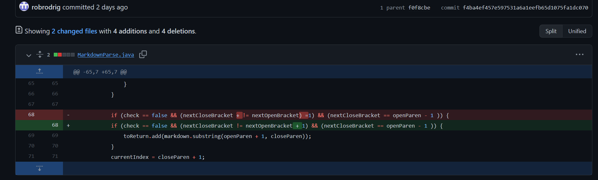
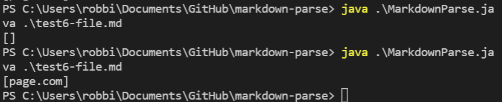
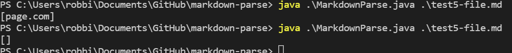
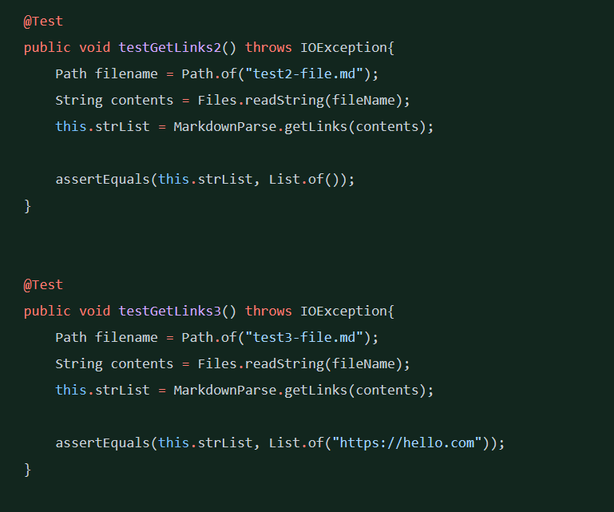
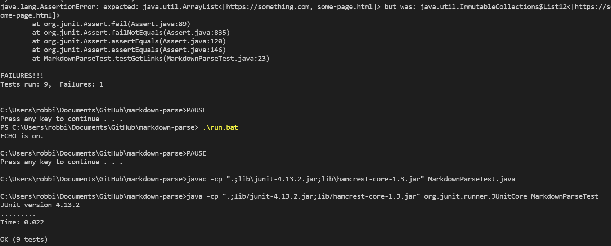

## Week 4 Lab Report

## When Tests Accumulate
# Topic of discussion: CASE STUDY: 3 Code Changes from either Lab 3 or Lab 4
***

# Code Change 1

The first code change to focus on was from Lab 3 MarkdownParse.java file, where changes were made in MarkdownParse.java to allow for the java code to compile with a test file that included a *failure-inducing* input that prompted us to make these changes.

Specifically this was for test6-file.md

[Test File](./test6-file.md)

The bug was not checking for the ordering of parenth and brackets, the symptom was returning an incorrect output, and the fix was: 



Our output:



# Code Change 2

The second code change was from Lab 4 MarkdownParseTest.java file, where we had to make changes to the assertEquals parameters so that our return output was what it should be.

This test was on test5-file.md

[Test File](./test5-file.md)

The bug was that assertEquals should have listed empty instead of the contents that wasn't correct. The symptom was outputting what was in the file, but it was wrong because it should have been an empty return output. The fix was to change the 

```
List.of(page.com) 
```
-to-
```
List.of()
```


The output:


# Code Change 3

The last code change was from Lab 4 on MarkdownParseTest.java file when our junit tests were getting 1 fail. 
The bug was incorrect formatting of objects in the code and the order of the assertEquals objects listing the string after the objects was a mistake. The symptom was that junit would continue the other tests but fail the 1 that was wrong. The fix was to reorder assertEquals to have the listStr first and the objects of expected output last, then re-ran my run.bat script (Since I'm *Windows 10*). And the test file this time that gave problems was test-file (the first one of course):

[Test File](./test-file.md)



The output:



& here's what my Windows Batch file looked like that helped automate my runs and save some keystrokes...

[Test File](./run.bat)

  ** 

Thanks for reading!

-Robert