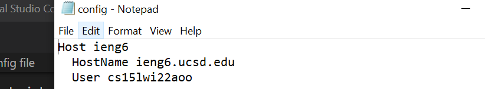
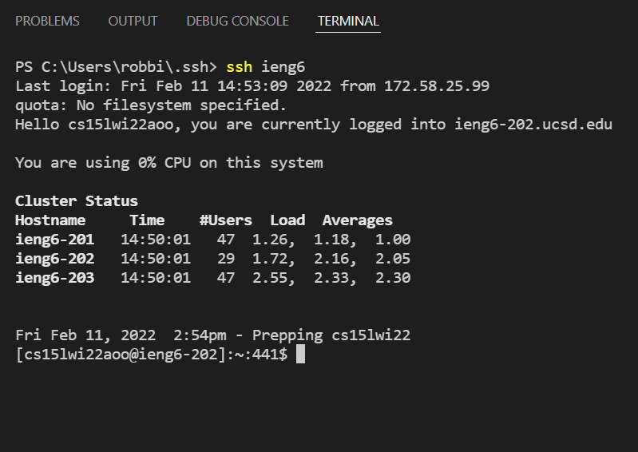
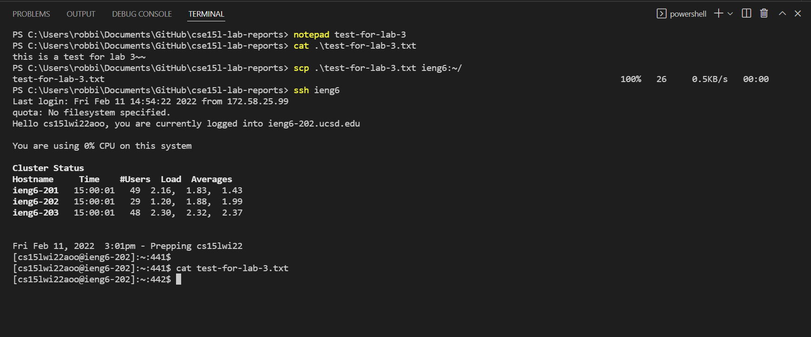

# Week 6 Lab Report

## Topic of discussion: Streamlining ```ssh``` configuration (Option 1)

Recall that when remotely connecting to the UCSD servers, you have to type something of the sorts:

```
ssh cs15lwi22zzz@ieng6.ucsd.edu
```

Which is exactly 22 characters too many. (or possibly more...)

Why, you ask? Well, as I've touched on in the past, you want your time dedicated to typing, troubleshooting, and debugging code for maximized efficiency. You can't dedicate all of your time to code when you have too many keystrokes just for connecting to the servers that host your code or else you won't have any time to finish your code!

So, a great solution is to store your ssh configurations and alias them in ssh configuration files!

In this lab report, I will show you how to do exactly that.

As a precursor to this lab write up, please make sure to refer to the "Connecting Remotely" section of [Lab Report 1](https://robrodrig.github.io/cse15l-lab-reports/lab-report-1-week-2.html) to ensure you have set up ```ssh``` *before* beginning this lab!!

## Modifying your ssh config file


Now, First things first, you need to modify the ```~/.ssh/config``` file on your local computer, as seen below in the screenshot:



To extrapolate, The first line is the "alias" you will call the server you're remoting into.
The second line is the Hostname of the server (fully qualified domain name is required)
The Third line is your username

**Remember to *tab* all the lines under line 1 for correct formatting!**

## Log in using your new ssh nickame

Next you will attempt to connect to your server via your newly created alias for your server like the screenshot shows below:



As you can see, the alias works for logging into your server! 

**NOTE** You can make your alias anything and as short or as long as you'd like! BUT, remember the username or this will not work!

## Attempt to scp using your new ssh alias

Now lets try the ```scp``` command and find out if our new alias for the server works in real life scenarios besides just for logging in:



As you can see in the screenshot, I created a file called *test-for-lab-3.txt" on my local computer, I used the ```cat``` command to display its contents so we can make sure later that the file was transferred accurately, I ```scp```'d the txt file to the UCSD server in my account's roote directory using the UCSD ssh alias, and then I ```ssh```'d into the server using the alias and ```cat```'d the file's contents from the server and verified that we ```scp```'d correctly. 

## Conclusion

I've shown you how to streamline ssh configuration on your computer to successfully remote into your servers in the most efficient way possible, effectively downsizing your character keystrokes to the most minimal amount possible.

I hope you enjoyed! Take care, stay safe, and see you next time!

-Robert 