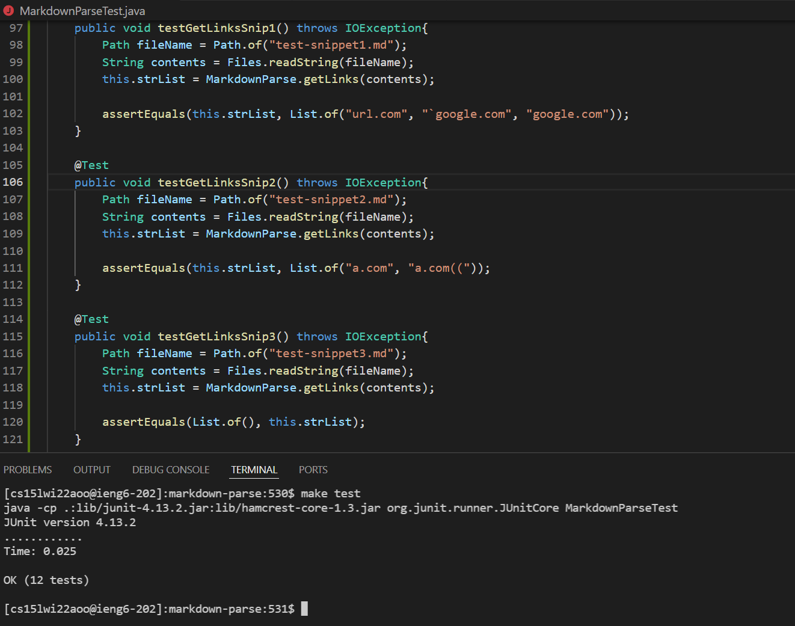
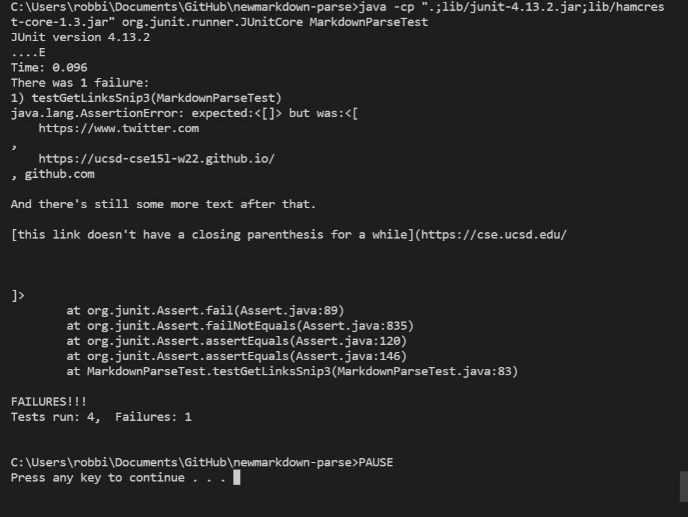

# Week 8 Lab Report 4

## Topic of discussion: Debuggers using the (3) given Snippets

My repo is at [MarkdownRepo](https://github.com/robrodrig/markdown-parse)

The Repo my group reviewed is at [ReviewedMarkdownRepo](https://github.com/xis004/markdown-parse)

## Snippet 1

The snippet here is as follows:

```
`[a link`](url.com)

[another link](`google.com)`

[`cod[e`](google.com)

[`code]`](ucsd.edu)
```

The test method used is as follows:
```
   @Test
    public void testGetLinksSnip1() throws IOException{
        Path fileName = Path.of("test-snippet1.md");
        String contents = Files.readString(fileName);
        this.strList = MarkdownParse.getLinks(contents);

        assertEquals(this.strList, List.of("url.com", "`google.com", "google.com"));
    }
```

Using my repo, the test succeeds. Here is a screenshot:



On the group review code implementation the snippet output is as follows:



As you can see, snip 1 and snip 2 test succeeded, with only a failure of snip 3 (I'll get to that later)

The improvement to code could involve testing for a back tick so it knows what the character is when its indexing. This way, when searching for the links it would run smoothly.

## Snippet 2

Snippet 2 contents:

```
[a [nested link](a.com)](b.com)

[a nested parenthesized url](a.com(()))

[some escaped \[ brackets \]](example.com)
```

Test method for the snippet: 

```
    @Test
    public void testGetLinksSnip2() throws IOException{
        Path fileName = Path.of("test-snippet2.md");
        String contents = Files.readString(fileName);
        this.strList = MarkdownParse.getLinks(contents);

        assertEquals(this.strList, List.of("a.com", "a.com(("));
    }
```

My code results garnered another success as seen in the following screenshot:


And on the group review implementation:


The code change for the program to work more efficiently than it did would to look for the brackets. That way the test case wouldn't fail the first time around, needing to run after making small changes.

## Snippet 3

Snippet 3 contents:

```
[this title text is really long and takes up more than 
one line

and has some line breaks](
    https://www.twitter.com
)

[this title text is really long and takes up more than 
one line](
    https://ucsd-cse15l-w22.github.io/
)


[this link doesn't have a closing parenthesis](github.com

And there's still some more text after that.

[this link doesn't have a closing parenthesis for a while](https://cse.ucsd.edu/


)

And then there's more text
```

The test method for this final snippet is:

```
  @Test
    public void testGetLinksSnip3() throws IOException{
        Path fileName = Path.of("test-snippet3.md");
        String contents = Files.readString(fileName);
        this.strList = MarkdownParse.getLinks(contents);

        assertEquals(List.of(), this.strList);
    }
```

As I've shown you before, the test succeeds, as does all 3 total, I will provide the screenshot once more here:


And for the group implementation:


I believe if I were to add the closing parenthesis case since the group review code didnt have it. Also I would add a test to find the new line and extra line additions.

Thanks for reading, see you next time!