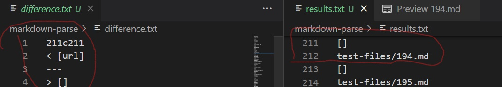
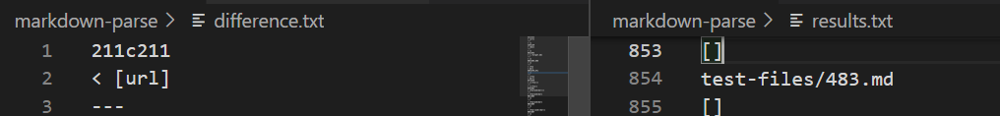

# Week 10 Lab Report 5

## Topic of discussion: Finding Diff Outputs

The way different outputs/results were found was by outputting the results of the ```script.sh``` script to a text file named ```results.txt```. I conducted this exercices on both my ```markdown-parse/``` directory and also the ```ucsd-cse15l-w22\markdown-parse``` directory. After having 2 ```results.txt``` files (one of my repo output and the other from the csd15l repo output), I then went ahead to begin running ```diff``` command on each ```results.txt``` files to find out whether the files had different outputs, which files were correctly showing me the output supposed to output, and whether they were neither correct. After running, differences were found on some files, I honed in and found what specfically was different and which file was giving me wrong output, and was able to correct the output.

## Test 1 of the File

One of the differently outputted file comparisons using ```diff``` was file 194.md as shown below the code is:
```
[Foo*bar\]]:my_(url) 'title (with parens)'

[Foo*bar\]]

```

Correct Output using VSCode File Preview feature:

```
Foo*bar]
```

Output from CSE repo versus my Repo:



Neither implementation is correct.

Bug Fix 1 for my repo:

So the fix is that I would need to account for adding a link to the file after a colon by checking in the ```getLinks``` while loop.

```
        while(currentIndex < markdown.length()) {
            if (nextCloseBracket > openParen) break;
            nextOpenBracket = markdown.indexOf("[", currentIndex);
            nextCloseBracket = markdown.indexOf("]", nextOpenBracket);
            openParen = markdown.indexOf("(", nextCloseBracket);
            closeParen = markdown.indexOf(")", openParen);
            if (nextOpenBracket == -1 || nextCloseBracket == -1 || openParen == -1 || closeParen == -1) break;
            if ( markdown.substring(openParen + 1, closeParen).contains(" ") ) break;


            //run for loop and .contains on the substring?
             boolean check = false;
             for ( String s : imageExtensions ){
                 if (markdown.substring(openParen+1, closeParen).contains(s)){
                    check = true;
                    break;
                } 
             }
```

## Test 2 of the File:

One of the differently outputted file comparisons using ```diff``` was file 483.md as shown below the code is:
```
[](./target.md)

```

Correct Output using VSCode File Preview feature:
```
[]
```

Output from CSE repo versus my Repo:



So the CSE implementation is wrong, where my implementation is correct.

Bug Fix 2 for CSE repo:

Instead of code looking for the first URL, have another while loop edited to look for the empty string and output that in the ```getLinks``` method where the if loop is:

```
    if(potentialLink.indexOf(" ") == -1 && potentialLink.indexOf("\n") == -1) {
                toReturn.add(potentialLink);
                currentIndex = closeParen + 1;
            }
```

Thanks for reading :)

-Robert R.